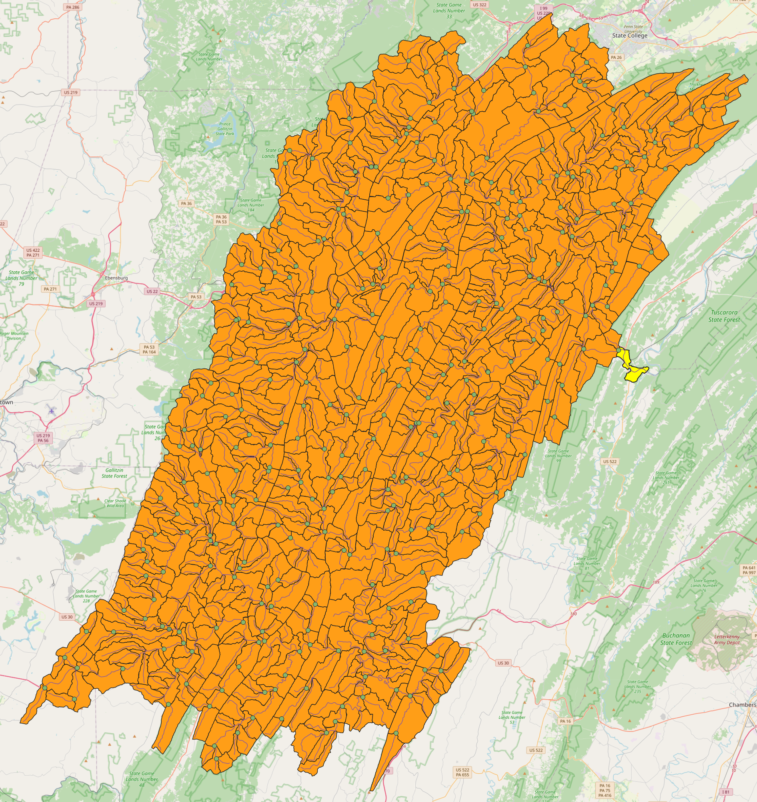

<p align="center">
  
</p>

# Distributed Differentiable Routing (DDR)

An implementation of differentiable river routing methods for the NextGen Framework and Hydrofabric

[](https://github.com/astral-sh/ruff)

> [!WARNING]
> This repo is a work in progress and will be updating frequently. Be sure to be using the most recent release version

#### Domain of interest:
The Juniata River Basin



#### Previous work and citation
- [dHBV2.0](https://github.com/mhpi/dHBV2.0)
```bibtex

@article{song_high-resolution_2025,
	title = {High-resolution national-scale water modeling is enhanced by multiscale differentiable physics-informed machine learning},
	volume = {61},
	copyright = {© 2025 The Author(s).},
	issn = {1944-7973},
	url = {https://onlinelibrary.wiley.com/doi/abs/10.1029/2024WR038928},
	doi = {10.1029/2024WR038928},
	abstract = {The National Water Model (NWM) is a key tool for flood forecasting, planning, and water management. Key challenges facing the NWM include calibration and parameter regionalization when confronted with big data. We present two novel versions of high-resolution (∼37 km2) differentiable models (a type of hybrid model): one with implicit, unit-hydrograph-style routing and another with explicit Muskingum-Cunge routing in the river network. The former predicts streamflow at basin outlets whereas the latter presents a discretized product that seamlessly covers rivers in the conterminous United States (CONUS). Both versions use neural networks to provide a multiscale parameterization and process-based equations to provide a structural backbone, which were trained simultaneously (“end-to-end”) on 2,807 basins across the CONUS and evaluated on 4,997 basins. Both versions show great potential to elevate future NWM performance for extensively calibrated as well as ungauged sites: the median daily Nash-Sutcliffe efficiency of all 4,997 basins is improved to around 0.68 from 0.48 of NWM3.0. As they resolve spatial heterogeneity, both versions greatly improved simulations in the western CONUS and also in the Prairie Pothole Region, a long-standing modeling challenge. The Muskingum-Cunge version further improved performance for basins {\textgreater}10,000 km2. Overall, our results show how neural-network-based parameterizations can improve NWM performance for providing operational flood predictions while maintaining interpretability and multivariate outputs. The modeling system supports the Basic Model Interface (BMI), which allows seamless integration with the next-generation NWM. We also provide a CONUS-scale hydrologic data set for further evaluation and use.},
	language = {en},
	number = {4},
	urldate = {2025-04-11},
	journal = {Water Resources Research},
	author = {Song, Yalan and Bindas, Tadd and Shen, Chaopeng and Ji, Haoyu and Knoben, Wouter J. M. and Lonzarich, Leo and Clark, Martyn P. and Liu, Jiangtao and van Werkhoven, Katie and Lamont, Sam and Denno, Matthew and Pan, Ming and Yang, Yuan and Rapp, Jeremy and Kumar, Mukesh and Rahmani, Farshid and Thébault, Cyril and Adkins, Richard and Halgren, James and Patel, Trupesh and Patel, Arpita and Sawadekar, Kamlesh Arun and Lawson, Kathryn},
	year = {2025},
	note = {\_eprint: https://onlinelibrary.wiley.com/doi/pdf/10.1029/2024WR038928
tex.ids= song2024highresolution},
	keywords = {*CIROH Cooperative Institute for Research to Operations in Hydrology (CIROH) through the NOAA Cooperative Agreement (grant no. NA22NWS4320003), *CIROH subaward A23-0271-S001 from Cooperative Institute for Research to Operations in Hydrology (CIROH) through the NOAA Cooperative Agreement (grant no. NA22NWS4320003), *DoE DE-SC0016605 (HyperFacets), *CA DWR 4600014294 (California Department of Water Resources Atmospheric River Program Phase III), *CIROH subaward A23-0252-S002 from Cooperative Institute for Research to Operations in Hydrology (CIROH) through the NOAA Cooperative Agreement (grant no. NA22NWS4320003), *DoE NERSC award ERCAP0024296},
	pages = {e2024WR038928},
	file = {Full Text PDF:/Users/taddbindas/Zotero/storage/TWJMPMM9/Song et al. - High-resolution national-scale water modeling is enhanced by multiscale differentiable physics-infor.pdf:application/pdf;Full Text PDF:/Users/taddbindas/Zotero/storage/46ZGUIZ5/Song et al. - 2025 - High-Resolution National-Scale Water Modeling Is E.pdf:application/pdf;Full Text PDF:/Users/taddbindas/Zotero/storage/JX2MD99P/Song et al. - 2025 - High-Resolution National-Scale Water Modeling Is Enhanced by Multiscale Differentiable Physics-Informed Machine Learning.pdf:application/pdf},
}

```

- [dMC-Juniata-HydroDL2](https://github.com/mhpi/dMC-Juniata-hydroDL2)
```bibtex
@article{https://doi.org/10.1029/2023WR035337,
author = {Bindas, Tadd and Tsai, Wen-Ping and Liu, Jiangtao and Rahmani, Farshid and Feng, Dapeng and Bian, Yuchen and Lawson, Kathryn and Shen, Chaopeng},
title = {Improving River Routing Using a Differentiable Muskingum-Cunge Model and Physics-Informed Machine Learning},
journal = {Water Resources Research},
volume = {60},
number = {1},
pages = {e2023WR035337},
keywords = {flood, routing, deep learning, physics-informed machine learning, Manning's roughness},
doi = {https://doi.org/10.1029/2023WR035337},
url = {https://agupubs.onlinelibrary.wiley.com/doi/abs/10.1029/2023WR035337},
eprint = {https://agupubs.onlinelibrary.wiley.com/doi/pdf/10.1029/2023WR035337},
note = {e2023WR035337 2023WR035337},
abstract = {Abstract Recently, rainfall-runoff simulations in small headwater basins have been improved by methodological advances such as deep neural networks (NNs) and hybrid physics-NN models—particularly, a genre called differentiable modeling that intermingles NNs with physics to learn relationships between variables. However, hydrologic routing simulations, necessary for simulating floods in stem rivers downstream of large heterogeneous basins, had not yet benefited from these advances and it was unclear if the routing process could be improved via coupled NNs. We present a novel differentiable routing method (δMC-Juniata-hydroDL2) that mimics the classical Muskingum-Cunge routing model over a river network but embeds an NN to infer parameterizations for Manning's roughness (n) and channel geometries from raw reach-scale attributes like catchment areas and sinuosity. The NN was trained solely on downstream hydrographs. Synthetic experiments show that while the channel geometry parameter was unidentifiable, n can be identified with moderate precision. With real-world data, the trained differentiable routing model produced more accurate long-term routing results for both the training gage and untrained inner gages for larger subbasins (>2,000 km2) than either a machine learning model assuming homogeneity, or simply using the sum of runoff from subbasins. The n parameterization trained on short periods gave high performance in other periods, despite significant errors in runoff inputs. The learned n pattern was consistent with literature expectations, demonstrating the framework's potential for knowledge discovery, but the absolute values can vary depending on training periods. The trained n parameterization can be coupled with traditional models to improve national-scale hydrologic flood simulations.},
year = {2024}
}
```
