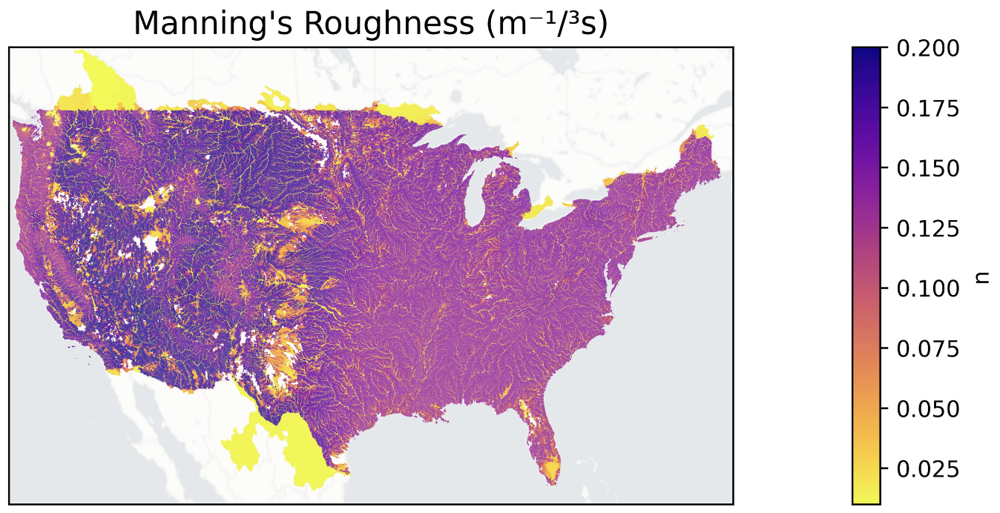

# Examples

There are a few pre-defined examples of how to use the `src/ddr` library in for

## Parameter Plots

  

This example is meant to show how to plot internal parameters learned by DDR trained models

## Model Evaluation

This notebook is meant to serve as an example for how to evaluate the performance of a trained model, and/or compare to the summation of Q_prime for your inputs. Summed Q` represents using a summation rather than routing and is a good indicator of the baseline performance of your model
